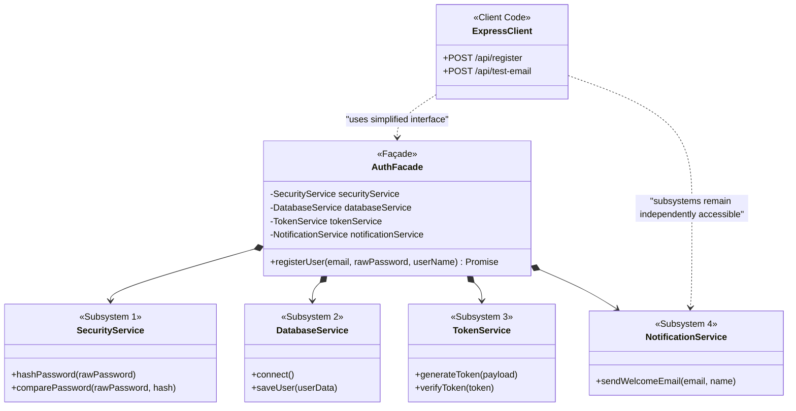

# User Registration Workflow 🏛️

> **An Express.js Backend demonstrating the Façade Design Pattern**  
> **Course:** CSE 3206 — Software Engineering Sessional | **Group:** 4 | **Teammate Roll:** 131

[](https://nodejs.org)
[-blue)]()
[](https://expressjs.com)
[](LICENSE)

---

## 📖 Overview

This project demonstrates the **Façade Pattern (GoF Structural)** in a Node.js/Express application.

When registering a user, several independent complex subsystems must be orchestrated:
1. **Password Hashing** via `bcrypt` (`SecurityService`)
2. **Database Persistence** via the plain `mongodb` driver (`DatabaseService`)
3. **JWT Authentication Token Generation** via `jsonwebtoken` (`TokenService`)
4. **Welcome Email Dispatch** via `nodemailer` using Ethereal test accounts (`NotificationService`)

Without a Façade, the client route handler is directly coupled to all four subsystems. Using **`AuthFacade`**, the client interacts with a clean, single-point method `registerUser(email, password)` while the subsystems remain decoupled and independently usable.

---

## 🏗️ Architecture & UML Class Diagram



---

## 📂 Project Structure

```
131-Facade/
├── package.json                   # Dependencies: express, mongodb, bcrypt, jsonwebtoken, nodemailer
├── server.js                      # Express App (Client code with 2 demo routes & testing UI)
├── facades/
│   └── AuthFacade.js              # The Façade class orchestrating all 4 subsystems
├── services/                      # Independent Subsystems (fine-grained APIs)
│   ├── DatabaseService.js         # Subsystem 1: Plain MongoDB driver operations
│   ├── SecurityService.js         # Subsystem 2: Bcrypt password hashing
│   ├── TokenService.js            # Subsystem 3: JWT token generation
│   └── NotificationService.js     # Subsystem 4: Nodemailer / Ethereal email dispatch
└── docs/
    ├── Lab3_Facade_Documentation.md  # Comprehensive 15-section Lab 3 report
    └── CodeReviewReport.md        # 10-dimension Code Review checklist
```

---

## 🚀 Setup & Execution

### 1. Install Dependencies
```bash
cd 131-Facade
npm install
```

### 2. Start the Server
```bash
npm start
```
The server will start at: **`http://localhost:3000`**

---

## 🧪 Live Demonstration & API Endpoints

### 1. Interactive Web Interface
Open your browser and visit:
👉 **`http://localhost:3000`**

An interactive UI allows one-click testing of both the Façade registration route and the independent email route with live JSON output.

### 2. The Façade Route (`POST /api/register`)
Encapsulates all 4 subsystems into a single API call:
```bash
curl -X POST http://localhost:3000/api/register \
  -H "Content-Type: application/json" \
  -d "{\"email\": \"student@ruet.ac.bd\", \"password\": \"SecretPassword123\", \"name\": \"RUET Student\"}"
```
**Sample Response:**
```json
{
  "success": true,
  "message": "User registered successfully through AuthFacade orchestration.",
  "data": {
    "userId": "6603a1f9e2...",
    "email": "student@ruet.ac.bd",
    "token": "eyJhbGciOiJIUzI1NiIsInR5cCI6IkpXVCJ9...",
    "emailDelivery": {
      "messageId": "<...>",
      "previewUrl": "https://ethereal.email/message/..."
    }
  }
}
```

### 3. The Independent Subsystem Route (`POST /api/test-email`)
Proves that `NotificationService` can be utilized directly without the Façade:
```bash
curl -X POST http://localhost:3000/api/test-email \
  -H "Content-Type: application/json" \
  -d "{\"email\": \"direct-test@ruet.ac.bd\", \"name\": \"Direct Subsystem User\"}"
```

---

## 📚 Documentation

- Detailed 15-section documentation: [`docs/Lab3_Facade_Documentation.md`](docs/Lab3_Facade_Documentation.md)
- Code review report: [`docs/CodeReviewReport.md`](docs/CodeReviewReport.md)
