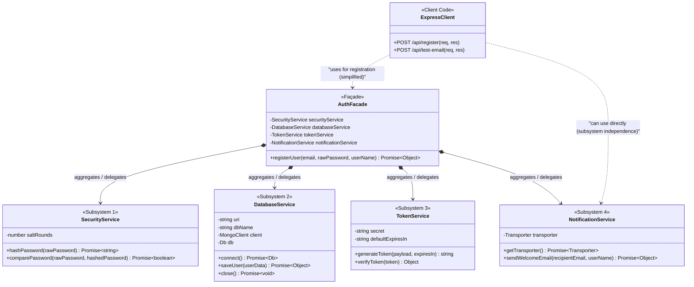

# Façade Design Pattern Documentation



---

## 1. Pattern Name
**Façade Design Pattern**

## 2. Category
**Structural Design Pattern** (GoF — Gang of Four)

## 3. Intent
The Façade Pattern provides a unified, higher-level interface to a set of interfaces in a subsystem. It defines a higher-level interface that makes the subsystem easier to use by wrapping complex orchestrations, dependencies, and fine-grained APIs into simple, cohesive operations for client callers.

## 4. Problem Statement
In modern web applications, high-level business actions rarely map to a single class or service. For example, a "User Registration" workflow requires:
1. Hashing plain-text passwords using a cryptographic library (`bcrypt`).
2. Persisting documents into a database using a database driver (`mongodb`).
3. Generating and signing authentication tokens (`jsonwebtoken`).
4. Establishing connections to SMTP mailers and dispatching welcome emails (`nodemailer`).

Without a Façade:
- The client (e.g., Express Route Handler / Controller) becomes tightly coupled to 4 separate subsystems.
- Business orchestration logic leaks into routing layers, violating the **Single Responsibility Principle (SRP)**.
- Code duplication increases if registration is triggered from multiple endpoints (CLI, REST API, Webhooks, Mobile Backend).
- Testing and maintaining individual subsystems becomes difficult due to tangled dependencies.

## 5. Motivation
Why is the direct/normal implementation poor?
- **High Coupling:** The Express route handler must instantiate, configure, and orchestrate 4 third-party libraries and service objects directly.
- **Fragile Architecture:** Changing database drivers (e.g., MongoDB to PostgreSQL) or email providers forces edits directly inside the routing layer.
- **Cognitive Overhead:** Developers consuming the subsystem must memorize the exact sequence, parameters, error formats, and initialization lifecycle of every component.
- **Poor Reusability:** Every new client route or script that registers users has to re-implement the exact 4-step sequence manually.

The **Façade Pattern** solves this by introducing `AuthFacade`, encapsulating the multi-step pipeline behind a single asynchronous method: `registerUser(email, password)`.

---

## 6. Pattern Structure (UML Structure Description)
The architecture consists of three main participant groups:

1. **Client (`server.js` / Express Routes):**
   - Interacts with `AuthFacade` through `POST /api/register`.
   - Has zero knowledge of hashing algorithms, database connection strings, JWT signing keys, or SMTP configurations.
   - Retains the ability to access individual subsystems directly when needed (`POST /api/test-email`).

2. **Façade (`AuthFacade`):**
   - Holds composition references to all subsystem services (`DatabaseService`, `SecurityService`, `TokenService`, `NotificationService`).
   - Knows which subsystem classes are responsible for each step and the order in which they must execute.
   - Delegates work to subsystems and aggregates results into a consistent payload.

3. **Subsystems (`services/*`):**
   - `SecurityService`: Handles hashing and password verification.
   - `DatabaseService`: Handles plain MongoDB database connections and queries.
   - `TokenService`: Handles JWT generation and verification.
   - `NotificationService`: Handles Nodemailer configuration and Ethereal email dispatch.
   - **Crucial Rule:** Subsystems have no knowledge of the Façade and never import or reference each other.

---

## 7. Class Responsibilities

| Class / Module | Role in Pattern | Responsibilities |
| :--- | :--- | :--- |
| `AuthFacade` | **Façade** | Encapsulates the entire registration lifecycle; instantiates or accepts subsystems via dependency injection; coordinates password hashing $\rightarrow$ database storage $\rightarrow$ token generation $\rightarrow$ email dispatch; returns clean unified responses. |
| `SecurityService` | **Subsystem 1 (Security)** | Generates cryptographic salt rounds and hashes passwords using `bcrypt`; verifies plain text against stored hashes. |
| `DatabaseService` | **Subsystem 2 (Storage)** | Manages plain MongoDB connection lifecycle using `MongoClient`; inserts user records into the database collection. |
| `TokenService` | **Subsystem 3 (Auth/Token)** | Creates signed JSON Web Tokens (JWT) containing user payloads and handles expiry and signature verification. |
| `NotificationService` | **Subsystem 4 (Notification)**| Configures Nodemailer with an Ethereal SMTP test account; composes HTML emails; dispatches messages and logs live web preview URLs. |
| `server.js` | **Client** | Defines REST API routes; acts as the consumer invoking `AuthFacade.registerUser()` for registration and directly testing `NotificationService` for independence. |

---

## 8. Code Implementation (Step-by-Step Explanation)

### Step 1: Subsystem 1 — Cryptographic Hashing (`SecurityService.js`)
```javascript
const bcrypt = require('bcrypt');

class SecurityService {
  constructor(saltRounds = 10) {
    this.saltRounds = saltRounds;
  }
  async hashPassword(rawPassword) {
    const salt = await bcrypt.genSalt(this.saltRounds);
    return await bcrypt.hash(rawPassword, salt);
  }
}
```

### Step 2: Subsystem 2 — Database Persistence (`DatabaseService.js`)
```javascript
const { MongoClient } = require('mongodb');

class DatabaseService {
  constructor(uri = 'mongodb://127.0.0.1:27017', dbName = 'lab3_facade_db') {
    this.uri = uri;
    this.dbName = dbName;
  }
  async saveUser(userData) {
    const db = await this.connect();
    const result = await db.collection('users').insertOne({ ...userData, createdAt: new Date() });
    return { id: result.insertedId.toString(), email: userData.email };
  }
}
```

### Step 3: Subsystem 3 — Token Issuance (`TokenService.js`)
```javascript
const jwt = require('jsonwebtoken');

class TokenService {
  constructor(secret = 'lab3_facade_jwt_secret_key') {
    this.secret = secret;
  }
  generateToken(payload, expiresIn = '2h') {
    return jwt.sign(payload, this.secret, { expiresIn });
  }
}
```

### Step 4: Subsystem 4 — Notification Dispatch (`NotificationService.js`)
```javascript
const nodemailer = require('nodemailer');

class NotificationService {
  async sendWelcomeEmail(recipientEmail, userName) {
    const transporter = await this.getTransporter();
    const info = await transporter.sendMail({
      from: '"CSE3206 Auth Team" <noreply@cse3206-lab3.ruet.ac.bd>',
      to: recipientEmail,
      subject: 'Welcome to Our Platform! 🎉',
      html: `<h2>Welcome ${userName}!</h2>`
    });
    return { messageId: info.messageId, previewUrl: nodemailer.getTestMessageUrl(info) };
  }
}
```

### Step 5: The Orchestrator Façade (`AuthFacade.js`)
```javascript
class AuthFacade {
  constructor(sec = new SecurityService(), db = new DatabaseService(), tok = new TokenService(), notif = new NotificationService()) {
    this.securityService = sec;
    this.databaseService = db;
    this.tokenService = tok;
    this.notificationService = notif;
  }

  async registerUser(email, rawPassword, userName) {
    const hashedPassword = await this.securityService.hashPassword(rawPassword);
    const savedUser = await this.databaseService.saveUser({ email, password: hashedPassword });
    const token = this.tokenService.generateToken({ userId: savedUser.id, email: savedUser.email });
    const emailResult = await this.notificationService.sendWelcomeEmail(email, userName);

    return {
      success: true,
      data: { userId: savedUser.id, email: savedUser.email, token, emailDelivery: emailResult }
    };
  }
}
```

### Step 6: Clean Client Route Integration (`server.js`)
```javascript
app.post('/api/register', async (req, res) => {
  try {
    const { email, password, name } = req.body;
    const authFacade = new AuthFacade();
    const result = await authFacade.registerUser(email, password, name);
    return res.status(201).json(result);
  } catch (error) {
    return res.status(400).json({ success: false, error: error.message });
  }
});
```

---

## 9. Execution Flow (Object Interaction)
1. **HTTP Client** sends `POST /api/register` with `{ email, password, name }`.
2. **Express Route Handler** receives request and calls `AuthFacade.registerUser()`.
3. **`AuthFacade`** starts orchestrating:
   - Invokes `SecurityService.hashPassword(rawPassword)` $\rightarrow$ Returns bcrypt hash.
   - Invokes `DatabaseService.saveUser(userData)` $\rightarrow$ Saves document in MongoDB and returns inserted ID.
   - Invokes `TokenService.generateToken(payload)` $\rightarrow$ Signs and returns JWT.
   - Invokes `NotificationService.sendWelcomeEmail(email, name)` $\rightarrow$ Dispatches Ethereal test email and obtains live preview link.
4. **`AuthFacade`** packages data into structured JSON and returns to route handler.
5. **Express Route Handler** sends HTTP 201 Response with JWT and email preview URL.

---

## 10. Advantages
- **Loose Coupling:** Clients depend only on the Façade interface, shielding them from subsystem changes.
- **Simplified API:** A single function call replaces dozens of lines of orchestration code.
- **Subsystem Independence:** Subsystem components remain fully usable on their own for fine-grained tasks.
- **Adherence to Clean Code / SRP:** Routing logic only handles HTTP requests/responses, while business coordination lives in the Façade.
- **Testability & Mocking:** Subsystems can be injected and mocked independently during automated testing.

## 11. Limitations
- **Risk of God Object:** If not carefully designed, a Façade can accumulate unrelated features and become an overly bloated class.
- **Additional Abstraction Layer:** For very simple CRUD applications requiring only 1 step, adding a Façade introduces unnecessary indirection.

---

## 12. Real-life Applications
- **E-Commerce Checkout:** Coordinating payment processing, inventory decrement, invoice PDF generation, and SMS/Email order confirmation.
- **Multimedia Transcoder:** Wrapping demuxers, audio decoders, video encoders, subtitle multiplexers, and file savers.
- **Operating System File I/O:** The high-level `fs.readFile()` in Node.js acts as a façade over complex low-level OS file descriptors, buffer allocations, and syscalls.

## 13. Industry Examples
- **jQuery:** `$.ajax()` provides a simple cross-browser façade over `XMLHttpRequest` and older ActiveX objects.
- **AWS SDK / Google Cloud Client Libraries:** High-level storage facades (e.g., `storage.bucket().upload()`) encapsulate HTTP request signing, chunked multipart uploads, and retry policies.
- **Spring Framework (`JdbcTemplate`):** Acts as a Façade over raw JDBC connection management, statement preparation, result-set parsing, and transaction rollbacks.

---

## 14. Demonstration (Steps for Live Execution)

### Prerequisites
- Node.js (v18+)
- Install dependencies: `npm install` inside `131-Facade/`

### Live Execution Steps
1. **Start the Express Server:**
   ```bash
   cd 131-Facade
   npm install
   npm start
   ```
2. **Open the Interactive Web Dashboard:**
   - Navigate to `http://localhost:3000` in the browser.
3. **Execute Façade Registration Test:**
   - Input: Email `student@ruet.ac.bd`, Password `SecretPassword123`.
   - Click **"Register via Façade"**.
   - Observe the terminal logging all 4 delegated steps: Hashing $\rightarrow$ Database $\rightarrow$ Token $\rightarrow$ Email.
   - Observe the live Ethereal URL returned in JSON, clickable to view the delivered email.
4. **Execute Subsystem Independence Test:**
   - Click **"Send Direct Email"** under `POST /api/test-email`.
   - Observe that email is sent directly via `NotificationService` without touching `AuthFacade` or database/auth subsystems.

---

## 15. Conclusion
The **Façade Pattern** successfully reduces system complexity by introducing a unified entry point over disparate subsystems without creating a closed barrier. In our Node.js user registration implementation, `AuthFacade` coordinates security, persistence, authentication, and communication services cleanly while leaving each subsystem fully decoupled, maintainable, and independently accessible.
